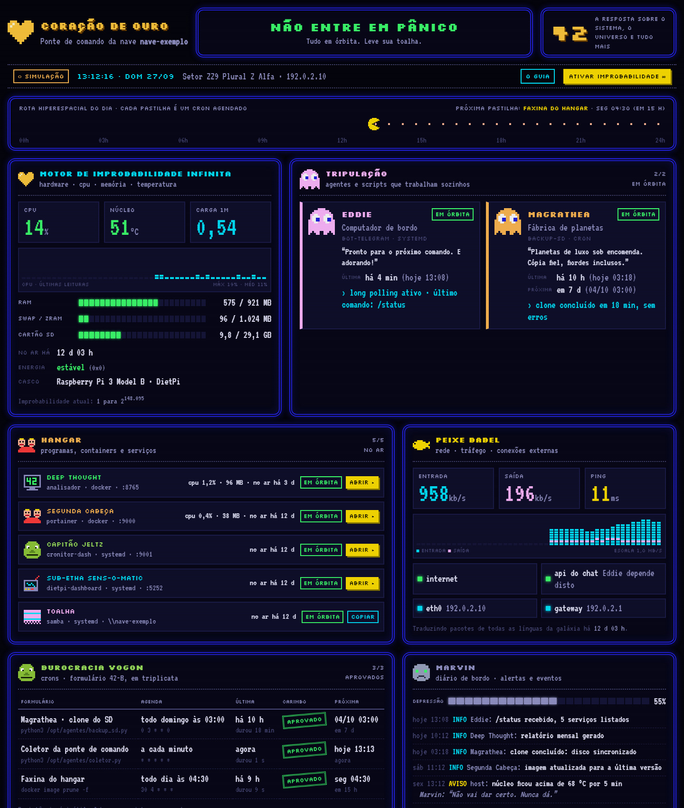

# Coração de Ouro

**Painel de controle 8-bit para servidores caseiros**, com o tema do _Guia do Mochileiro das
Galáxias_ e visual de fliperama. Mostra, numa página só, o hardware, os agentes (scripts), os
programas, os crons e os eventos de um servidor pequeno, como um Raspberry Pi.



> Não entre em pânico: a captura acima usa só dados fictícios (`?demo`).

## Por que existe

A proposta é ter um painel **divertido e útil** ao mesmo tempo. Cada área tem um nome do livro, e o
estado de cada coisa aparece como no Pac-Man:

| No painel                    | O que é                                                                                                  |
| ---------------------------- | -------------------------------------------------------------------------------------------------------- |
| **42**                       | Nota de saúde: proporção de checagens que passaram, na escala de 0 a 42.                                 |
| **Não entre em pânico**      | Resumo do estado; lista os problemas quando há algum.                                                    |
| **Rota do dia**              | O Pac-Man anda com o relógio; cada pastilha grande é um cron de hoje. Se há problema, o Blinky persegue. |
| **Motor de Improbabilidade** | CPU, temperatura, RAM, swap, cartão SD e alertas de energia (`vcgencmd get_throttled`).                  |
| **Tripulação**               | Agentes e scripts. Fantasma normal = ok, assustado = falha, só olhos = parado.                           |
| **Hangar**                   | Programas e containers, com atalho para abrir cada um.                                                   |
| **Peixe Babel**              | Rede: tráfego, ping, internet e serviços externos de que os agentes dependem.                            |
| **Burocracia Vogon**         | Crons com carimbos APROVADO / INDEFERIDO e próxima execução.                                             |
| **Marvin**                   | Diário de bordo; quanto mais erros, mais deprimido ele fica.                                             |
| **Terra Mk II**              | Roadmap do que ainda vai ser instalado.                                                                  |

O glossário completo fica no próprio painel, no botão **O GUIA**.

## Como funciona

```
┌──────────── host ────────────┐        ┌────────── container ──────────┐
│ coletor (cron, a cada minuto) │  lê    │ servidor Node (Express)        │
│   → /run/coracao-de-ouro/     │ ─────▶ │   valida status.json (Joi)     │ ◀── navegador
│      status.json  (tmpfs)     │  (ro)  │   /api/status  /api/theme      │     (a cada 15 s)
└───────────────────────────────┘        │   serve o front (ES modules)   │
                                         └────────────────────────────────┘
```

- **O painel só lê.** Nenhum botão executa comandos no servidor.
- **O coletor não faz parte deste repositório.** Ele roda no host, porque precisa de `docker`,
  `systemctl` e `vcgencmd`, e grava um JSON no formato do
  [contrato do status](docs/contrato-status.md). Qualquer linguagem serve.
- O servidor **descarta campos desconhecidos** do JSON antes de enviá-lo ao navegador.
- Sem status, o painel mostra **SEM SINAL** e nota 0. Dados fictícios só aparecem quando pedidos
  explicitamente (`?demo`).

## Implantação (Docker)

A imagem é publicada no GitHub Container Registry para `linux/amd64`, `linux/arm64` e
`linux/arm/v7` (Raspberry Pi 2/3/4/5).

```bash
# docker-compose.yml deste repositório como ponto de partida
docker compose pull
docker compose up -d
```

Abra `http://<ip-do-servidor>:4242`. O `docker-compose.yml` monta `/run/coracao-de-ouro` do host
como somente leitura em `/dados`, roda o container com sistema de arquivos só leitura, sem
capabilities, e limita a memória a 128 MB.

### Variáveis de ambiente

| Variável                             | Padrão                                                | Descrição                                                                                            |
| ------------------------------------ | ----------------------------------------------------- | ---------------------------------------------------------------------------------------------------- |
| `PORT`                               | `4242`                                                | Porta HTTP.                                                                                          |
| `HOST`                               | `0.0.0.0`                                             | Interface de escuta.                                                                                 |
| `STATUS_PATH`                        | `./data/status.json` (`/dados/status.json` na imagem) | Arquivo gerado pelo coletor.                                                                         |
| `STATUS_STALE_AFTER_S`               | `180`                                                 | Idade a partir da qual os dados contam como velhos.                                                  |
| `THEME_PATH`                         | —                                                     | Tema próprio (nomes dos seus agentes e roadmap). Ver [tema](docs/contrato-status.md#tema-themejson). |
| `LOG_LEVEL`                          | `info`                                                | `debug`, `info`, `warn` ou `error`. Logs em JSON, uma linha por evento.                              |
| `PANEL_USER` / `PANEL_PASSWORD_HASH` | —                                                     | Autenticação HTTP Basic opcional. Defina as duas ou nenhuma.                                         |

### Autenticação (opcional)

Pensado para a rede local, o painel sobe **sem login** por padrão. Para exigir usuário e senha:

```bash
npm run hash-password          # pede a senha sem eco e imprime PANEL_PASSWORD_HASH=scrypt:...
```

Coloque `PANEL_USER` e o hash gerado no ambiente do container. A senha é guardada como hash
**scrypt** (N=2¹⁵), comparada em tempo constante, e cada IP fica limitado a 30 tentativas falhas a
cada 15 minutos. `/healthz` continua público para o `HEALTHCHECK`. Para expor o painel fora de casa,
use um proxy reverso com HTTPS na frente.

### Tema próprio (nomes dos seus agentes)

Todo agente, programa ou cron que está no `status.json` aparece no painel, mesmo sem tema. Quem não
tem verbete aparece com o id em maiúsculas, o papel "Tripulante recém-embarcado" e uma cor de
fantasma. O tema serve para dar a cada um nome, papel, cor e frases do Guia.

**Não edite o `src/theme/defaultTheme.json`.** Ele vai dentro da imagem, então a próxima
atualização apaga o que você mudar. Crie um tema seu com **só o que for novo ou diferente**. O
servidor mescla esse arquivo com o padrão, verbete a verbete:

```json
{
  "agentes": {
    "id-do-agente-no-status-json": {
      "nome": "Arthur Dent",
      "papel": "Terráqueo de roupão",
      "cor": "#00e5ff",
      "desc": "O que esse agente faz.",
      "frases": ["Eu nunca consegui me acostumar com as quintas-feiras."]
    }
  }
}
```

Depois, aponte `THEME_PATH` para esse arquivo:

- **Docker:** ative no `docker-compose.yml` a variável `THEME_PATH=/tema/theme.json` e o volume
  `./theme.json:/tema/theme.json:ro`.
- **Local:** salve o arquivo em `data/theme.json`, que fica fora do Git, e coloque
  `THEME_PATH=./data/theme.json` no `.env`.

Regras principais:

- A chave de cada agente precisa ser **igual ao `id`** que o coletor grava em `agentes[]`.
- Todos os campos são obrigatórios. `nome` vai até 40 caracteres, `papel` até 60, `desc` até 200 e
  `frases` tem de 1 a 10 itens de até 140 caracteres.
- A cor só é aceita no formato `#rrggbb`.
- `agentes`, `programas` e `crons` são mesclados pelo id. O `roadmap`, se aparecer no seu arquivo,
  substitui a lista padrão inteira.
- Não precisa reiniciar o servidor: o tema é lido a cada pedido, então basta recarregar a página.
- Se o tema for inválido, o painel usa o padrão e grava `tema.personalizado_ignorado` no log, com o
  motivo.

Todos os campos, incluindo `programas`, `crons` e `roadmap`, estão em
[`examples/theme.example.json`](examples/theme.example.json) e no
[contrato do tema](docs/contrato-status.md#tema-themejson). O limite de 50 agentes vale para o
`status.json`, não para o tema.

## Desenvolvimento

Requisitos: **Node.js 22.13+**.

```bash
npm install
npm run dev:coletor-falso        # grava data/status.json simulado a cada 15 s (calmo | vogons | panico)
npm run dev                      # servidor com reload em http://localhost:4242
```

Sem coletor, abra `http://localhost:4242/?demo` ou `?cenario=panico` para ver a simulação no
navegador.

| Comando                                   | O que faz                                                   |
| ----------------------------------------- | ----------------------------------------------------------- |
| `npm test`                                | Roda a suíte (Jest).                                        |
| `npm run test:coverage`                   | Testes com cobertura mínima de 90% (quebra abaixo disso).   |
| `npm run lint`                            | ESLint.                                                     |
| `npm run format` / `format:check`         | Prettier.                                                   |
| `npm run typecheck`                       | Checagem de tipos dos JSDoc com `tsc` (sem etapa de build). |
| `npm run check`                           | Tudo acima, na ordem do CI.                                 |
| `npm test -- tests/unit/lib/cron.test.js` | Um arquivo de teste só.                                     |

### Estrutura

```
src/                  servidor (Express)
  app.js              monta o app com dependências injetadas
  server.js           ponto de entrada (liga fs, stdout e sinais)
  config.js           variáveis de ambiente, validadas
  api/                rotas: /api/status, /api/theme, /healthz
  status/             leitura e schema do status.json
  theme/              tema padrão, schema e mesclagem
  middleware/         CSP, autenticação, rate limit, log, erros
  auth/               hash scrypt de senha
public/               front estático, sem bundler
  js/lib/             lógica pura (cron, saúde/42, formatos) — testável sem DOM
  js/render/          um módulo por painel
  js/data/            cliente da API, controlador e simulação
  js/sprites/         sprites 8-bit desenhados em mapas de caracteres
  css/                base, layout, componentes, painéis, efeitos
tests/                unit/, integration/ (supertest), frontend/ (jsdom), fakes/ e helpers/
examples/             status e tema de exemplo (dados fictícios)
docs/                 contrato do status.json e do tema
```

## Versionamento e release

Versionamento semântico, com a versão no `package.json` como fonte única.

```bash
npm version minor                # ou patch / major: atualiza package.json e cria a tag vX.Y.Z
git push --follow-tags
```

A tag dispara o workflow **Release**, que:

1. confere se a tag bate com o `package.json`;
2. roda formatação, lint, tipos, testes com cobertura e `npm audit`;
3. publica a imagem multi-arch em `ghcr.io/gadotti/painel-coracao-de-ouro` (`latest`, `X.Y.Z`,
   `X.Y`), com SBOM e proveniência;
4. cria a release no GitHub com o pacote `painel-coracao-de-ouro-X.Y.Z.zip` e as notas geradas.

Todo push e PR passa pelo workflow **CI** (as mesmas checagens, mais o build da imagem sem
publicar). O Dependabot propõe atualizações semanais de npm, Actions e imagem base, esperando 7
dias após cada publicação.

Para atualizar no servidor: `docker compose pull && docker compose up -d`.

## Segurança

- CSP rígido: scripts, estilos e fontes só do próprio painel, sem `inline`. As fontes vêm junto
  com o painel, então ele não faz requisições a terceiros.
- Textos vindos do coletor são escapados; links só aceitam `http(s)`; cores só `#rrggbb`.
- Erros para o cliente não trazem stack trace nem caminho de arquivo; o detalhe fica no log.
- Container como usuário sem privilégios, com arquivos somente leitura.

Encontrou uma vulnerabilidade? Veja [SECURITY.md](SECURITY.md).

## Créditos

- Homenagem de fã a _O Guia do Mochileiro das Galáxias_, de Douglas Adams, e aos fliperamas dos
  anos 80. Projeto sem vínculo com os detentores dessas marcas.
- Fontes [Silkscreen](https://github.com/googlefonts/silkscreen) e VT323, sob a SIL Open Font
  License (licenças em [`public/fonts/`](public/fonts/)).

## Licença

[MIT](LICENSE).
